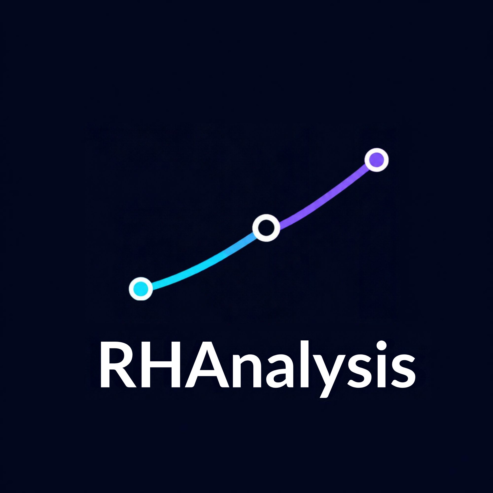
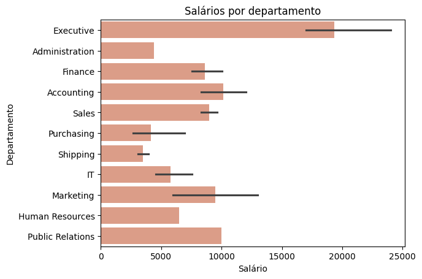
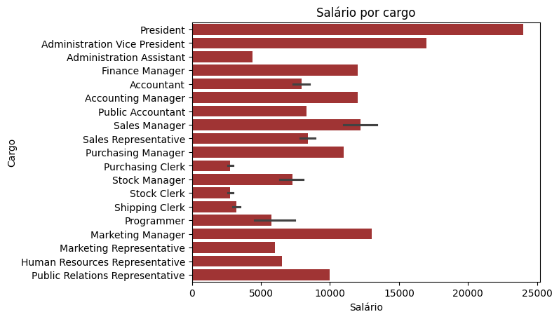

<p align="center">
  
</p>

# Projeto Avaliativo Módulo 1 - SCTEC
Essa Análise Exploratória de Dados (AED) contempla a avaliação do Módulo I do curso Visualização de Dados e Business Intelligence do SCTEC. Nela, são analisados dados das tabelas do esquema HR do banco FreeSQL. São elas: hr.regions, hr.countries, hr.locations, hr.departments, hr.jobs e hr.employees; que juntas contém as seguintes colunas: salário, código do funcionário, data da contratação, nome do departamento, cargo, nome do país e nome da região.

## 🎯 Objetivos
* Analisar a qualidade e usabilidade dos dados
* Tratar dados nulos ou duplicados
* Identificar salários dos funcionários por departamento e cargo
* Identificar funcionários por região
* Realizar uma análise estatística relacionada aos salário dos funcionários
* Identificação dos tipos de dados
* Verificação de dados nulos e inexistentes
* Criação de gráficos para melhor visualização dos resultados

## 🛠️ Tratamento dos dados
Foram realizados os seguintes procedimentos nos dados:
* Aplicação de filtro para eliminar nulos
* Alteração dos nomes das colunas
* Conversão da coluna "data da contratação" para datetime
* Análise exploratória da coluna salário, onde foram obtidos os seguintes resultados:
  * Contagem: 106, refere-se ao número de valores não nulos daquela coluna.
  * Média: 6456,75.
  * Desvio padrão: 3927,79, o que indica uma variação considerável nos salários dos funcionários em relação à média.
  * Mínimo: 2100.
  * Primeiro quartil: 3100, quer dizer que 25% dos funcionários ganham até 3100.
  * Mediana: 6150, metade da empresa ganha até esse valor, a outra metade ganha acima disso.
  * Terceiro quartil: 8950, significa que 75% dos funcionários recebem até 8950.
  * Máximo: 24000, representa o maior salário da empresa.
 
## 💻 Como Executar o Projeto

Esta análise foi desenvolvida no **Google Colab** e os dados são carregados automaticamente via GitHub.

### Você pode abrir o projeto diretamente no Colab para executar o código:
1. Acesse o arquivo `projeto_avaliativo_T3_tassiana_gulias.ipynb` aqui no repositório.
2. Clique no link abaixo para abrir direto no Colab:

[](https://colab.research.google.com/github/Tassigulias/projeto_avaliativo_modulo-1_SCTEC/blob/main/projeto_avaliativo_T3_tassiana_gulias.ipynb)

3. No menu superior do Colab, clique em **Ambiente de execução** > **Executar tudo** (ou use o atalho `Ctrl + F9`).


## 💡 Insights
### Análise de salários por departamento
<p align="center">
  
</p>
Na análise dos departamentos, verificamos que os setores de logística e de compras são os que menos recebem. E os setores de gerência e contabilidade são os que mais ganham, estando entre os 25% dos funcionários com salários mais altos.

### Análise de salários por cargo
<p align="center">
  
</p>

Nesta análise, observa-se que o Presidente possui o maior salário da organização, enquanto as remunerações mais baixas concentram-se nos cargos operacionais e administrativos de Auxiliar de Estoque e Auxiliar de Compras. 

Estes dois últimos cargos somam 25 funcionários e estão posicionados no primeiro quartil, representando os 25% da empresa com rendimentos até 3.100. O elevado desvio padrão identificado nos dados é explicado pela forte dispersão gerada pelo salário do Presidente (24.000), que atua como um *outlier* em relação à distribuição salarial geral.

### Análise de funcionários por região (gráfico)


## 📂 Estrutura do Projeto
```text
projeto-avaliativo/
├── query_1.csv
├── query_2.csv
├── salario_antiguidade.png
├── salario_cargo.png
├── salario_departamento.png
├── salario_pais.png
├── projeto_avaliativo_T3_tassiana_gulias.ipynb
└── README.md
```

## 🤖 Observações
Foram utilizados recursos de inteligência artificial:

* No JOIN do arquivo query_2.sql
* Para passar a coluna data_da_contratacao para DATETIME
* Para formular o código de salários de um mesmo cargo por data de contratação.
* Para mudar as cores nos gráficos e ver a paleta de nomes.
* Para organizar a "Estrutura do Projeto" no README em forma de árvore.
* Na etapa de "Como Executar o Projeto" aqui no README.
